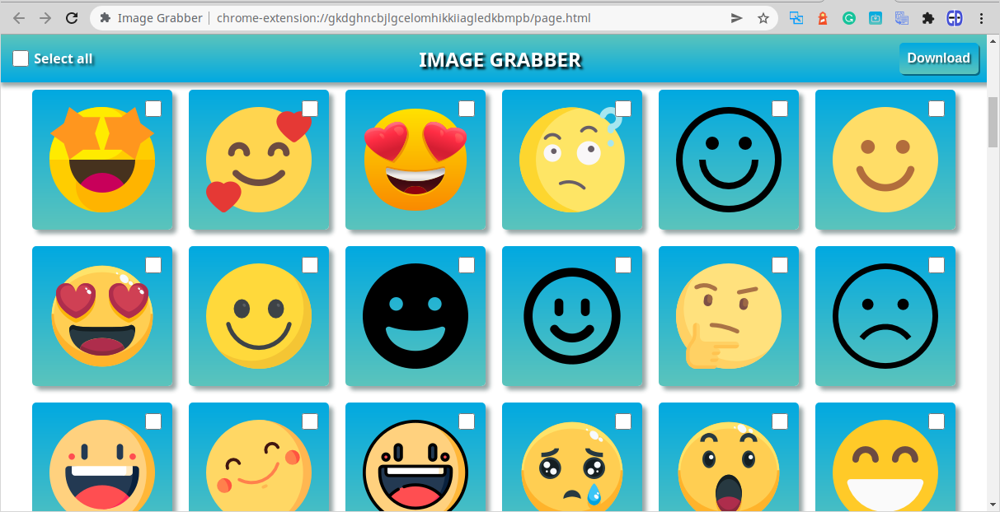

# Image Grabber
Google Chrome extension used to grab a list of images from current webpage.

This is a source code for a series of articles on https://dev.to, that you can read here:

[Create a Google Chrome Extension Part 1](https://dev.to/andreygermanov/create-a-google-chrome-extension-part-1-image-grabber-1foa)
[Create a Google Chrome Extension Part 2](https://dev.to/andreygermanov/create-a-google-chrome-extension-part-2-image-grabber-47h7)

